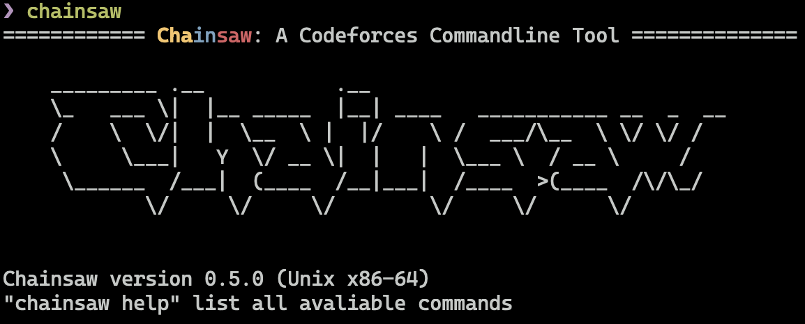
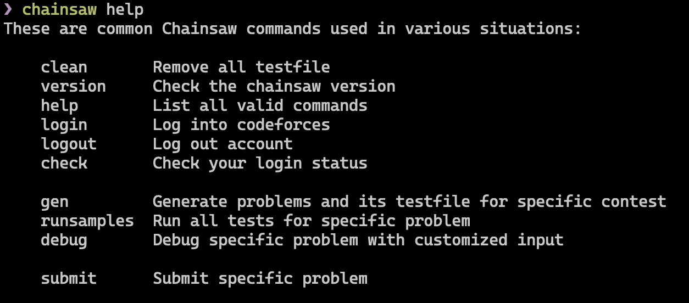
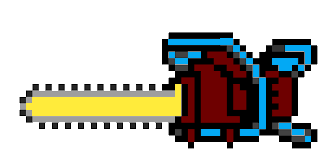

#  chainsaw: A Codeforces Command Line Tool

chainsaw is a small and faster drop-in replacement for your copy-paste and load while attending Codeforces contests. chainsaw is created for increasing 
competitive programmer productivity by reducing run sample test and submit time especially in real-time contests and the sites kind of lagging due to the traffic.

## Why does the speed matter?

No matter you are a competitive programmer or a hobby coder, while attending a contest, you always want things to be as convenient as possible.
A contest consists of three phases. In the first phase, you create all your `*.cpp` or any other language file. In the second phase, you write algorithms to solve that specific problem.
In the third phase, you compile your program and run all sample tests from website to check whether your code is correct.

The first phase and third phase are just repetitive copy and paste work, but it will waste a lot of time if you just do it by your self, and a little bit annoying. chainsaw can make it automatically, and much faster, saving your time and keeping you from being distracted while copy the test file from website and re-compile your program and check whether it is correct. The difference is most noticeable when you are in rapid fix/debug-edit-recompile cycles.


## Install

chainsaw is written in C++17, so if you want to install chainsaw on your machine. you need a very recent version of GCC or Clang. I'm using macOS Monterey 12.1 as a development platform, I'm also testing that in Ubuntu 20.04 LTS, it can also install successfully. In that two environment, you can install chainsaw by the following commands:

#### Ubuntu 20.04 and later / macOS Monterey 12.1 and later

```shell
git clone https://github.com/Angold-4/chainsaw.git

cd chainsaw

./install.sh
```

If no error reported, then restart your shell, now you can run chainsaw on your command line.




By default, `chainsaw` is installed to `/usr/local/bin`

## How to use



<details><summary>A classic way to use chainsaw</summary>

<br>


</details>


## Why is chainsaw so fast?

One reason is because it simply uses faster algorithms and efficient data structures. The other reason is that the sample tests generator is highly parallelized.

I using `curl`, a very clean and simple library to fetch all html files, and using `pthread` to parallize the http Request, which means you can fetch 8 problems's html file just by costing one http request time.

In my machine, the `chainsaw gen` command only costs `4` seconds for any kinds of contests in Codeforces, which is superfast.

# Logo


## Credits
* **[cfparser.vim](https://github.com/gabrielsimoes/cfparser.vim)**
